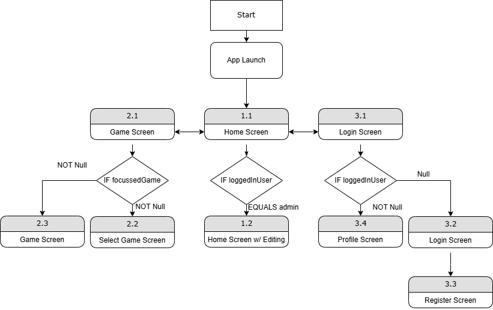
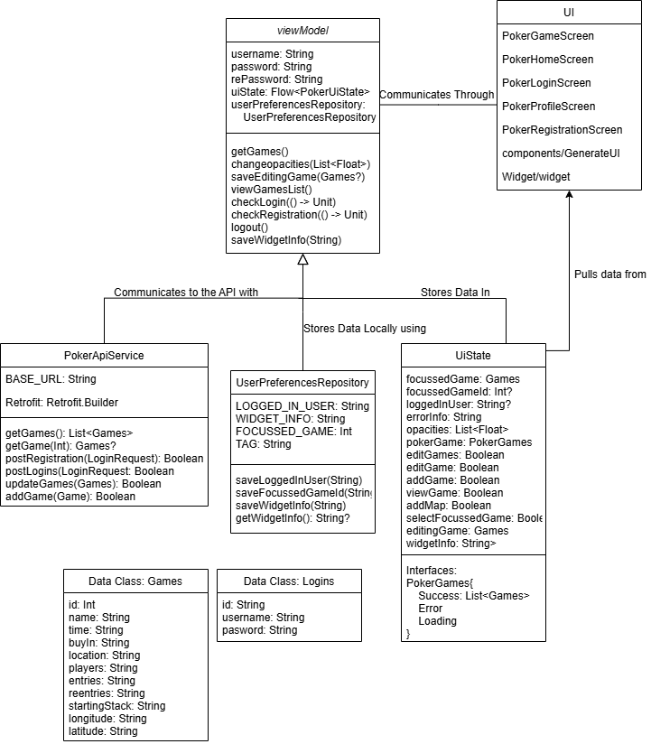
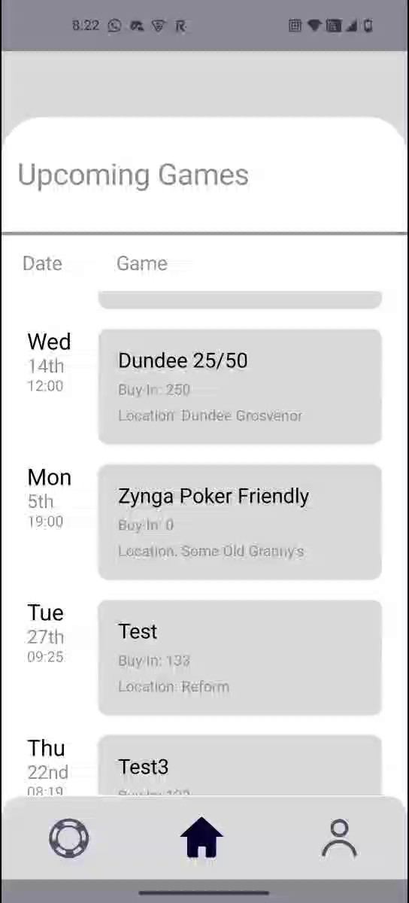
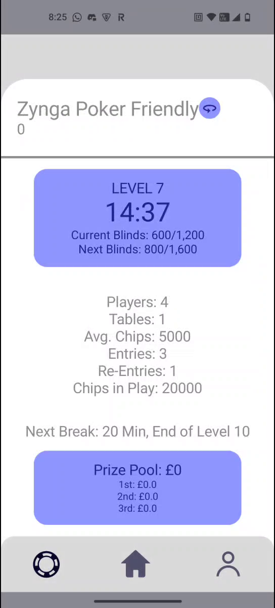
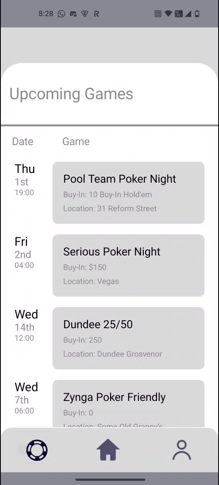

# Android-Poker-Tracker
This project involved creating an android app using Kotlin that followed the best practices outlined by Google. It connects to a custom REST API written in PHP and stores information regarding upcoming poker games and registered users in a MySQL database.
 
## Overview
The project contains 6 different screens that the user can navigate between. This includes a secure login / register screen, a user profile screen, a homepage and a game view and select game page. Users with admin access are able to add and edit upcoming games in the homepage.

 
Below is the class diagram for the app. All main variables generated by the app itself are stored in the UIState, with data retrieved from the API stored in Data Classes for each table in the database. The API itself has functions that call the API to request a list of all games or a single game, update and add new games, and process login and registration requests. This is all retrieved or called by the ViewModel that handles temporary variables and the functions to call each process or update the screen. 

 
## End Result
The following images are screenshots of the completed application. 
 
The homepage:
 

  
The game view screen:
 

  
And Selecting a game:
 

